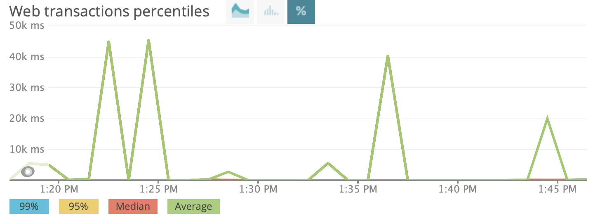

# Lab Report Template for CIS411_Lab3
Course: Messiah College CIS 411, Fall 2018<br/>
Instructors: [Joel Worrall](https://github.com/tangollama) & [Trevor Bunch](https://github.com/trevordbunch)<br/>

Name: Bryce Doane<br/>

GitHub: [BryceDoane](https://github.com/BryceDoane)<br/>

# Step 1: Fork this repository
- The URL of my forked repository

https://github.com/BryceDoane/cis411_lab3

# Step 2: Clone your forked repository from the command line
- My GraphQL response from adding myself as an account on the test project
```
{
  "data": {
    "mutateAccount": {
      "id": "a10db030-ded8-4397-a78f-30b79d3497ab",
      "name": "Bryce Doane",
      "email": "bd1275@messiah.edu"
    }
  }
}
```

# Step 3: Signup for and configure New Relic
- The chosen name of your New Relic ```app_name``` configuration
```
app_name: ['cis411lab3']
```

# Step 4: Exercising the application / generating performance data

_Note: No lab notes required._

# Step 5: Explore your performance data
* What are your observations regarding the performance of this application? 

<b> This application performs not amazingly well.  While some queries come back instantly, others will take several seconds to return results.  More often than not with the searches we were given, they took a decent amount of time to complete </b>
* Is performance even or uneven? 

<b> The performance was often uneven, depending on the reques</b>
* Between queries and mutations, what requests are less performant? 

<b>Queries were less performant.  The mutations took less time to perform</b>
* Among the less performant requests, which ones are the most problematic?

<b> The most problematic requests were the final request for gmail accounts and the search for orders that contained "everything".

# Step 6: Diagnosing an issue based on telemetry data
* Within the transactions you're examining, what segment(s) took the most time?

The segments that took the most time were often queryOrdersBySearchTerm and loadOrderByID
* Using New Relic, identify and record the least performant request(s).

The least performant requests were the search for orders that contained "everything" and "PA"
* Using the Transaction Trace capability in New Relic, identify which segment(s) in that request permiatation is/are the most problematic and record your findings.

loadOrderById and queryOrdersBySearchTerm were the most problematic segments in the least performant requests
* Recommend a solution for improving the performance of those most problematic request(s) / permiatation(s).

I believe changing the query for the everything bagel from   label: "everything" to bagel: "everything" will return the desired results much quicker.  For the other request, using "location: PA" rather than "query: PA" gives the actual desired results.  If the search is truly for every query with the letters "pa", then it will probably just need to take that long.

# Step 7: Submitting a Pull Request
_Note: No lab notes required._

# Step 8: [EXTRA CREDIT] Address the performance issue(s)
For the purposes of gaining 25% extra credit on the assignment, perform any of the following:
1. Adjust the diagnosed slow call(s) to improve performance. 
2. Verify the improved performance in New Relic, **including data and/or screenshots in your lab report**.
2. Check in those changes and **note your solution(s)** in your lab report.

To increase the performance on the slowest call, I changed
```
{
  #retrieve all orders container the word everything
  orders(query: "everything") {
    id
    customer {
      id
      email
    }
    items {
      label
      quantity
    }
  }
}
```
to
```
{
  #retrieve all orders container the word everything
  orders(bagel: "everything") {
    id
    customer {
      id
      email
    }
    items {
      label
      quantity
    }
  }
}
```

Making this change moved the response time from 40,300 milliseconds to 92.3 milliseconds returning the same results.  As seen in the image below, the last two spikes are the original request and the modified request, respectively.

