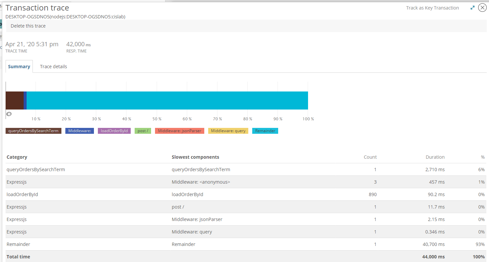

# Lab Report Template for CIS411_Lab3
Course: Messiah College CIS 411, Fall 2018<br/>
Instructors: [Joel Worrall](https://github.com/tangollama) & [Trevor Bunch](https://github.com/trevordbunch)<br/>

Name: Eric Weischedel<br/>

GitHub: [eric-weischedel](https://github.com/eric-weischedel)<br/>

# Step 1: Fork this repository
- The URL of my forked repository: https://github.com/eric-weischedel/cis411_lab3

# Step 2: Clone your forked repository from the command line
- My GraphQL response from adding myself as an account on the test project
```
{
  "data": {
    "mutateAccount": {
      "id": "76c241e9-37bd-4420-be03-56ab06d3006a",
      "name": "Eric Weischedel",
      "email": "ew1309@messiah.edu"
    }
  }
}
```

# Step 3: Signup for and configure New Relic
- The chosen name of your New Relic ```app_name``` configuration
```
app_name: ['cislab']
```

# Step 4: Exercising the application / generating performance data

_Note: No lab notes required._

# Step 5: Explore your performance data
* What are your observations regarding the performance of this application? <br>

> The performance is really bad. The response time goal is .10 seconds but the service is responding at .83 seconds on average. For `GET` requests the service runs fast (less than 9ms), but for `POST` requests it takes almost a full second.

* Is performance even or uneven? <br>

> Performance is *uneven*. As I said, `POST` requests are taking much longer than `GET` requests.

* Between queries and mutations, what requests are less performant?

> Queries are less performant. Mutations are completed almost instantly, while queries generally take more time.

* Among the less performant requests, which ones are the most problematic?

> Queries that use the `query` keyword take very long. I suspect this is because it searches all fields for the supplied keyword; whereas, if you specify a field, it will only search that field for the keyword.

# Step 6: Diagnosing an issue based on telemetry data
* Within the transactions you're examining, what segment(s) took the most time?

> As I said, `POST` requests took the most time.

* Using New Relic, identify and record the least performant request(s).

```
{
  #retrieve all orders container the word everything
  orders(query: "everything") {
    id
    customer {
      id
      email
    }
    items {
      label
      quantity
    }
  }
}
```

* Using the Transaction Trace capability in New Relic, identify which segment(s) in that request permiatation is/are the most problematic and record your findings.

> It looks like `queryOrdersBySearchTerm` is the slowest part of the request. Here is an image of the Transaction Trace:



* Recommend a solution for improving the performance of those most problematic request(s) / permiatation(s).

> The problem with these search queries is that they search all the fields in the order object. To make the computation faster, it could search only certain fields that would make sense for the search. For example, if you're searching for "everything", you are not looking for order id, customer id, customer email, or item quantity. By reducing the amount of properties that the search query is matched against, the request would take substantially less time.

# Step 7: Submitting a Pull Request
_Note: No lab notes required._