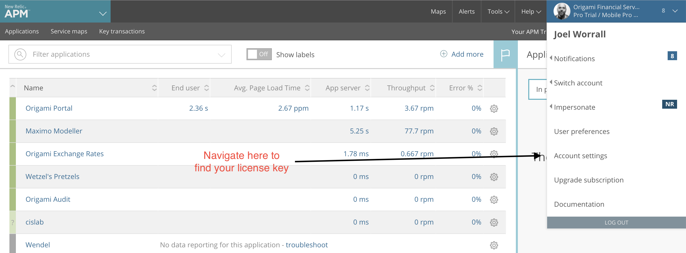
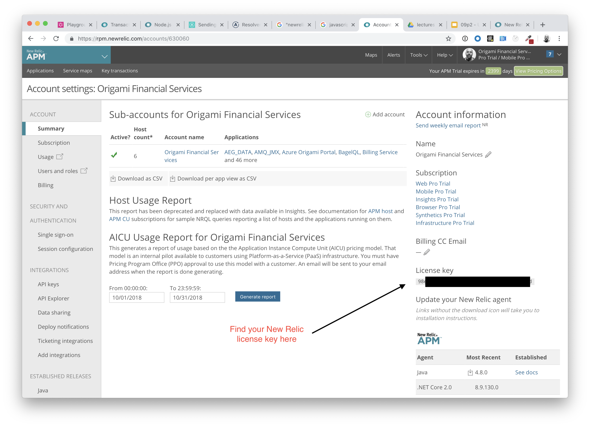
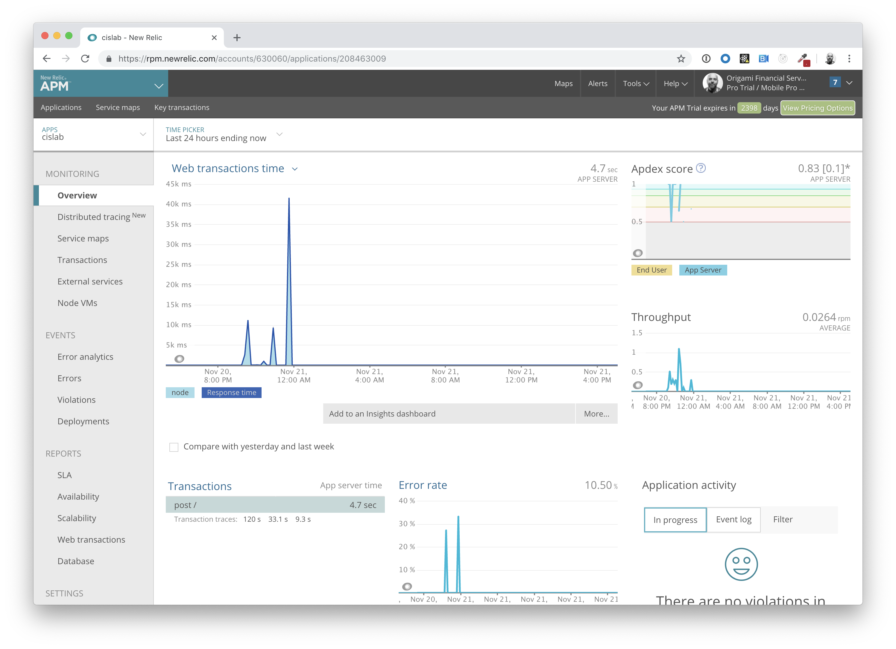

# CIS 411 Lab 3: Monitoring, Observability, and Performance Profiling and using New Relic
The purpose of this lab is to expose students to the base concepts surrounding monitoring and code inspection using the New Relic nodejs agent to profile a GraphQL interface in the Apollo GraphQL Server.

## Notes
1. This lab requires that a student be able to signup for a basic New Relic account and configure a newrelic.js configuration file in the base directory of the project. (See the instructions below)
2. As of the publication of this lab, the New Relic nodejs agent has suboptimal support for GraphQL libraries. Thus the additional code referencing the [custom instrumentation capabilities in the New Relic nodejs agent](https://docs.newrelic.com/docs/agents/nodejs-agent/api-guides/nodejs-agent-api) that you'll find in the project code.
3. All the data provided in ```testdata.js``` is completely fictious, generated by random data generation tools. If you find a real person or email address in this list, [let me know](mailto:joel@joelworrall.com) and I'll publish an update. It's not in anyone's interest to expose [PII](https://en.wikipedia.org/wiki/Personally_identifiable_information) (real or randomly generated).

## TODO
Update/simplify the code in this lab once the New Relic nodejs agent has more complete support for the Apollo Server.

## Submitting work
Lab reports will be submitted by generating a markdown file in the labreports directory under the naming convention: **LAB_[GITHUB HANDLE].md**, and submitting a Pull Request to this repository that include your lab report as well as any accompanying images/files (there are diagrams required in the lab content). 

* Throughout these instructions, you'll find that **items marked in bold text** reference content you are to submit in your lab report.
* For the purposes of clear communication, you may base your lab report off of the template found in [LAB.md](LAB.md), but you're also free, welcome, and encouraged to get more creative.
* If you are unfamiliar with markdown, I recommend checking [1000 places on the Interwebs](http://lmgtfy.com/?q=learn+markdown) that will help you close that gap.

# Step 0: Setting up your dev environment
1. If you don't have a GitHub account already, [create one](https://github.com/join). If you do, **record the name of your handle in your lab report**.
2. If you don't already have _git_ installed on your development machine, [do so](https://git-scm.com/downloads).
3. Install a text editor or some sort of application for local development. Lately, I'm partial to [Visual Studio Code](https://code.visualstudio.com/) and my instructions assume it's use, but you're welcome to diviate. _Each one should choose their own sword, etc. etc._
4. To run the project in Step 2, you'll need to have [node.js](https://nodejs.org/en/download/) and [npm](https://docs.npmjs.com/cli/install) installed.

# Step 1: Fork this repository
1. After logging in, navigate to the [root](https://github.com/tangollama/cis411_lab3) of this repository.
2. Fork this repository to your personal GitHub account (hint: read the page).

# Step 2: Clone your forked repository from the command line and run the project
1. Navigate to your forked repository in your GitHub account and copy the reference to your repository in from the <button class="btn btn-sm btn-primary">Clone or Download</button> button.
2. Open the terminal or command line interface on your development machine, navigate to your chosen working directory, and execute the following command: ```git clone [YOUR COPIED GITHUB CLONE REFERENCE]```.
3. Navigate to that directory ```cd cis411_lab3```.
4. Run ```npm install``` and watch the magic happen.
5. Run ```npm start``` and navigate to http://localhost:4000/graphql.
6. Run the following GraphQL mutation in GraphiQL and **record the response**.
```
mutation {
  mutateAccount(input: {
    email: "YOUR EMAIL"
    name: "YOUR FULL NAME"
    mutation: "add"
  }) {
    id
    name
    email
  }
}
```

7. Stop your service with a ```Ctrl+C```, as we need to setup New Relic for telemetry acquisition.

# Step 3: Signup for and configure New Relic
In its downloaded state, the project will run successfully but fail to record any performance data to New Relic because you must follow the [installation instructions for the New Relic nodejs agent](https://docs.newrelic.com/docs/agents/nodejs-agent/installation-configuration/install-nodejs-agent). There's a great 4-minute video on the nodejs installation process [here]((https://docs.newrelic.com/docs/agents/nodejs-agent/installation-configuration/install-nodejs-agent)), under the heading, _View installation video_. 

To accomplish the necessary configuration, perform the following.

1. [Signup for a New Relic account] (https://newrelic.com/signup)
2. Once you've registered for an account, [login to New Relic](https://rpm.newrelic.com/).
3. Navigate to your account settings at ```https://rpm.newrelic.com/accounts/```

4. Find and copy the License key in the lower right side of the page. (You'll need it in a future step.)

5. Copy the newrelic.js file from your local development environment's npm_modules directory into the root on your project.
```
# Command assumes you're in cis411_lab3 directory and have run 'npm install' already
> cp node_modules/newrelic/newrelic.js .
```
6. Open the newrelic.js file in the root of your project.
```
# Command assumes the use of VS Code
> code newrelic.js
```
7. In the newrelic.js file in the root of your project, find the ```app_name``` parameter and set it to **cislab** (or whatever name you prefer).
```
app_name: ['cislab'],
```

8. In the newrelic.js file in the root of your project, find the ```license_key``` parameter and set it to the value of your ```license key```.
9. Save the newrelic.js file with those changes.
10. Run ```npm start``` and navigate to http://localhost:4000/graphql and run a few GraphQL queries.
11. After a minute (to allow the collector to begin sending performance data), login to New Relic and verify that you can see performance data.


12. Go back to the ```Overview``` page and click on an entry under the ```Transactions``` list called ```post /```.
13. Find the linked titled ```Track as key transaction``` and click it. 

# Step 4: Exercising the application / generating performance data
Open a web browser to ```http://localhost:4000/graphql```  and run the following series of GraphQL requests:
```
{
  #all orders containing the word PA
  orders(query: "PA") {
    id
    customer {
      id
      email
    }
    items {
      label
      quantity
    }
  }
}
```
```
{
  #all orders in Pennsylvania  
  orders(location: "PA") {
    id
    customer {
      id
      email
    }
    items {
      label
      quantity
    }
  }
}
```
```
{
  #all orders with an item that contains an onion bagel
  
  orders(bagel: "onion") {
    id
    customer {
      id
      email
    }
    items {
      label
      quantity
    }
  }
}
```
```
{
  #all orders in Texas
  orders(location: "TX") {
    id
    customer {
      id
      email
    }
    items {
      label
      quantity
    }
  }
}
```
```
{
  #all orders with an item that contains a raisin bagel
  orders(bagel: "raisin") {
    id
    customer {
      id
      email
    }
    items {
      label
      quantity
    }
  }
}
```
```
{
  #retrieve all orders container the word everything
  orders(query: "everything") {
    id
    customer {
      id
      email
    }
    items {
      label
      quantity
    }
  }
}
```
```
{
  #all accounts that contain gmail.com
  accounts(query: "gmail.com") {
    id
    items {
      label
      quantity
    }
  }
}
```

Explore a few more mutations and queries in GraphQL to create a good base of requests for the nodejs client to profile. Did you notice if any of those requests seemed particularly slow? Which ones? How much? Why? (Note: these are rhetorical questions meant to underscore the point of the next step.)

# Step 5: Explore your performance data
1. [Open (or log back into) New Relic](https://rpm.newrelic.com) and select your ```cislab``` (or whatever you chose to set the app_name configuration in your newrelic.js) application in the application list.
2. **Observe and record** what the Overview page for your application has to tell you about the performance of your GraphQL service.
3. At the bottom of the ```Overview``` page, click on your ```Host```, and **record** what it's telling you about the health/performance of your compute device.
4. Go back to the ```Overview``` page and click on an entry under the ```Transactions``` list called ```post /```.
5. Scroll down to the section marked ```Transaction traces``` and click on a long-running transaction. What **segment** of the transaction took the most time?
6. **Repeat step 5 for 3 other transactions**.
7. What are your observations regarding the performance of this application? Is performance even or uneven? Between queries and mutations, what requests are less [performant](https://en.wiktionary.org/wiki/performant)? Among the less performant requests, which ones are the most problematic?

# Step 6: Diagnosing an issue based on telemetry data
Amongst the requests in this GraphQL server, there is one specific permiatation of a request that is the most problematic (hint: I put it there on purpose).

1. Using New Relic, **identify and record the least performant request(s)**.
2. Using the Transaction Trace capability in New Relic, identify which segment(s) in that request permiatation is/are the most problematic and **record your findings**.
3. **Recommend a solution** for improving the performance of those most problematic request(s) / permiatation(s).


# Step 7: Submitting a Pull Request
Once you've completed your report markdown, have ensured that your forked repository is successfully running in CircleCI, and have committed all your changes to your (primary) master branch, initiate a Pull Request in GitHub to submit your Lab Report.
1. Navigate to the root of your forked repository (ex. https://github.com/YOURHANDLE/cis411_lab3).
2. Click the _New pull request_ button.
3. Choose the base fork _tangollama/cis411_lab3_ is the target and that your fully updated _master_ branch is the source.
4. Enter a title and description for the Pull Request (PR).

# Step 8: [EXTRA CREDIT] fix the performance issue(s)
For the purposes of gaining 25% _or even more extra credit_ on the assignment, perform the following:
1. Adjust the diagnosed slow call(s) to improve performance. 
2. Verify the improved performance in New Relic, **including data and/or screenshots in your lab report**.
2. Check in those changes and **note your solution(s)** in your lab report.

**Note this work in your lab report** by submitting it in your PR and linking to either the PR or the specific commit as recorded in GitHub in your lab report.
