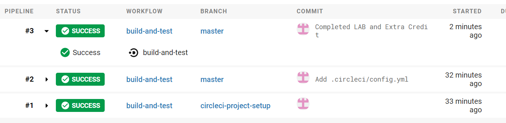

# Lab Report Template for CIS411_Lab3
Course: Messiah College CIS 411, Fall 2018<br/>
Instructors: [Joel Worrall](https://github.com/tangollama) & [Trevor Bunch](https://github.com/trevordbunch)<br/>

Name: YOUR NAME<br/>

GitHub: [JostonChan](https://github.com/JostonChan)<br/>

# Step 1: Fork this repository
- The URL of my forked repository
https://github.com/JostonChan/cis411_lab3.git

# Step 2: Clone your forked repository from the command line
- My GraphQL response from adding myself as an account on the test project

Response recorded: 


# Step 3: Signup for and configure New Relic
- The chosen name of your New Relic ```app_name``` configuration
```
app_name: ['cislab3-JostonChan']
```

# Step 4: Exercising the application / generating performance data

_Note: No lab notes required._

# Step 5: Explore your performance data
* What are your observations regarding the performance of this application? 

The performance of this application is very different as the response time for each query is different. 
The response time for the 'everything' query is the longest among the queries. 

* Is performance even or uneven? 

The performance is uneven.

* Between queries and mutations, what requests are less performant? 
The information below is the rank of the quesries from 1, being the most performant, to 6, being the least performant. 
```
1. orders(location: "PA") - 145ms
2. orders(location: "TX") - 165ms
3. orders(bagel: "onion") - 389ms
4. orders(query: "PA") - 4,590ms
5. orders(bagel: "raisin") - 6,590ms
6. orders(query: "everything") - 48,100ms
Error: accounts(query: "gmail.com")
```

The least performant request is the 'everything' query as it took 48,100ms and the most performant is the 'location:PA'. There is also a query that causes an error, which is the 'gmail.com' query. 

* Among the less performant requests, which ones are the most problematic?

According to the rank above, orders(query: "everything") is the most problematic.  

# Step 6: Diagnosing an issue based on telemetry data
* Within the transactions you're examining, what segment(s) took the most time?

Query for 'everything' took the longest of 48,100ms and the remainder segment of it took the most time of 44,300 ms. 

* Using New Relic, identify and record the least performant request(s).

```
{
  #retrieve all orders container the word everything
  orders(query: "everything") {
    id
    customer {
      id
      email
    }
    items {
      label
      quantity
    }
  }
}
```
* Using the Transaction Trace capability in New Relic, identify which segment(s) in that request permiatation is/are the most problematic and record your findings.

The most problematic request permiatation or the one that took the most time is the remainder segment(44,300ms), followed by queryOrdersBySearchTerm(3,100ms).I also provide a rank of the segments from the least problematic to the most. 

```

1. getOrders - 0.212ms
2. Middleware: jsonParser - 0.565ms
3. post\ - 7.83ms
4. loadOrderById - 141ms
5. Middleware - 550ms
6. queryOrdersBySearchTerm - 3,100ms
7. Remainder - 44,300ms

```

* Recommend a solution for improving the performance of those most problematic request(s) / permiatation(s).

Querying for everything is a bad request because it will be searching for 'everything' in every field. 
The more precise the request are, the less time the request will take and thus, improving the performance of the request.
For example, changing the orders(query: "everything") to orders(bagel: "everything"). 

# Step 7: Submitting a Pull Request
_Note: No lab notes required._

 

# Step 8: [EXTRA CREDIT] Address the performance issue(s)
For the purposes of gaining 25% extra credit on the assignment, perform any of the following:
1. Adjust the diagnosed slow call(s) to improve performance. 
2. Verify the improved performance in New Relic, **including data and/or screenshots in your lab report**.

The graph below shows the comparison between the orders(query: "everything") and the improved version, orders(bagel: "everything"), 
The improvements have made the 'everything' request from 51,852ms to 407ms, a significant decrease of 51,445 or 99.2%. 

 

2. Check in those changes and **note your solution(s)** in your lab report.

By using the proposed solution from Step 6, I have made the orders(query: "everything") query to be more precise.
By changing 'query' to 'bagel', it searches the word 'everything' in just the bagel fields, instead of all fields. 

```
{
  #retrieve all orders container the word everything
  orders(bagel: "everything") {
    id
    customer {
      id
      email
    }
    items {
      label
      quantity
    }
  }
}
```