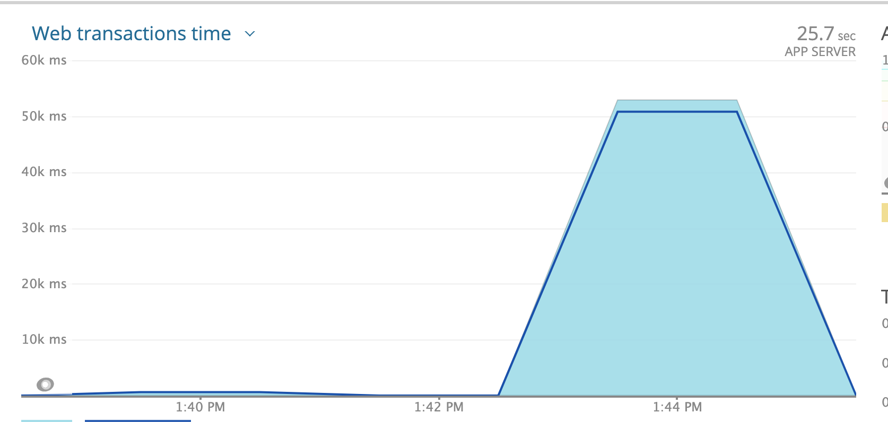
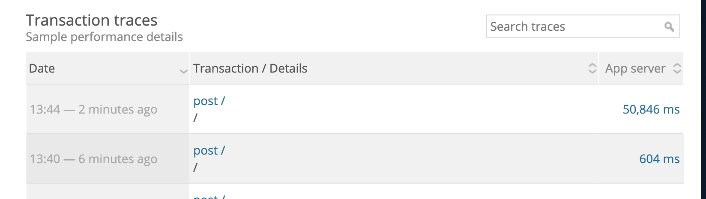
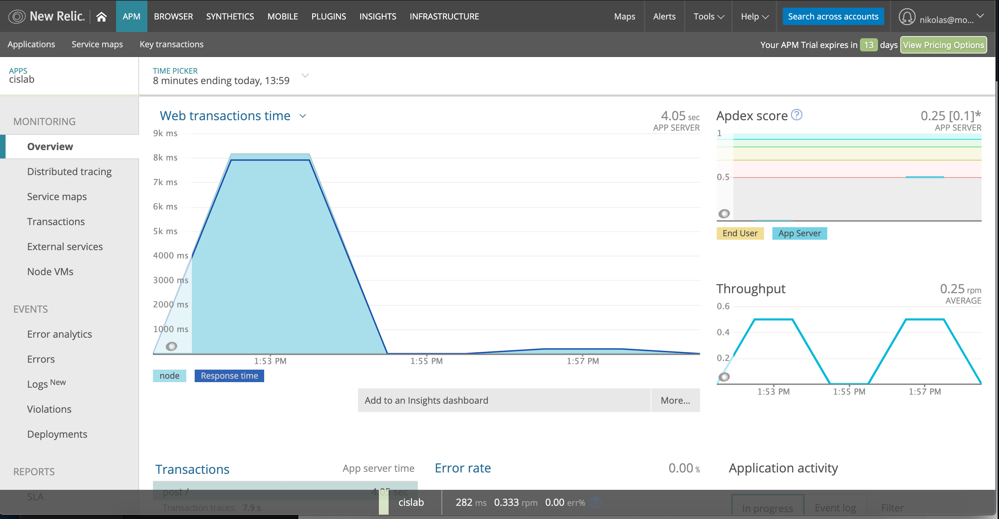

# Lab Report Template for CIS411_Lab3
Course: Messiah College CIS 411, Fall 2018<br/>
Instructors: [Joel Worrall](https://github.com/tangollama) & [Trevor Bunch](https://github.com/trevordbunch)<br/>

Name: Nik Mourelatos<br/>

GitHub: [NikMourelatos](https://github.com/NikMourelatos)<br/>

# Step 1: Fork this repository
- https://github.com/NikMourelatos/cis411_lab3

# Step 2: Clone your forked repository from the command line
- My GraphQL response from adding myself as an account on the test project
```
{
  "data": {
    "mutateAccount": {
      "id": "b5b36cd7-ee78-4039-b63f-b54333445054",
      "name": "Nikolas Michael Mourelatos",
      "email": "nm1287@messiah.edu"
    }
  }
}
```

# Step 3: Signup for and configure New Relic
- The chosen name of your New Relic ```app_name``` configuration
```
app_name: ['cislab']
```

# Step 4: Exercising the application / generating performance data

_Note: No lab notes required._

# Step 5: Explore your performance data
* What are your observations regarding the performance of this application? 
```
From Host Section:
Apdex:  0.17
Resp. Time: 5,970ms
Throughput: 1 rpm
Error Rate: 22.20%
CPU Usage: 3%
Memory: 110 MB

When working with this for the first time it is obvious that
when doing a query the response time is much slower than 
anything else, especially when querying for everything.
```
* Is performance even or uneven? 
```
Preformance is uneven, as some mutations/queries took around 1 
second or 7 seconds, to another which took around 45 seconds.
```
* Between queries and mutations, what requests are less performant? 
```
Queries are less preformant as we see when querying for "everything" it took around 44,000ms (45 seconds), 
and the only other query we do (that doesn't result in an 
error) takes the second most amount of time, 7,000ms (7  seconds).
```
* Among the less performant requests, which ones are the most problematic?

```
A query that takes 45 seconds (in our case a query for everything) 
to respond in any case would be problematic as one should expect a faster response time from a query. 
Therefore, the query for "everything" is the most problematic.
```
# Step 6: Diagnosing an issue based on telemetry data
* Within the transactions you're examining, what segment(s) took the most time?
```
Query For Everything took the longest 
taking 46,000ms
```
* Using New Relic, identify and record the least performant request(s).
```
Least Preformant Test:
{
  #retrieve all orders container the word everything
  orders(query: "everything") {
    id
    customer {
      id
      email
    }
    items {
      label
      quantity
    }
  }
}
```
* Using the Transaction Trace capability in New Relic, identify which segment(s) in that request permiatation is/are the most problematic and record your findings.
```
queryOrdersBySearchTerm: 2800ms -6% of duration
Remainder: 41,500ms -90% of duration
```
* Recommend a solution for improving the performance of those most problematic request(s) / permiatation(s).

```
in short, a query for everything in all fields is impractical, a more concise query is needed, 
the paramater must then be more specific to minimize the query response time, since it searches every category, 
one can make one that grabs all categories by searching one field. This is a prime example of a superfluous database call.

```

# Step 7: Submitting a Pull Request
_Note: No lab notes required._

# Step 8: [EXTRA CREDIT] Address the performance issue(s)
For the purposes of gaining 25% extra credit on the assignment, perform any of the following:
1. Adjust the diagnosed slow call(s) to improve performance. 
```
As stated in my answer for question 6 a more concise query is needed, 
therefore changing query to bagel the response time is improved.  
The reason this works is becuase we were only interested in Everything 
bagels prior so instead of searching each field for 
the word everything we now only search the bagel field.

Change for the Everything Query:

{
  
  orders(bagel: "everything") {
    id
    customer {
      id
      email
    }
    items {
      label
      quantity
    }
  }
}
This took around 600ms for response time.
50000ms to 600ms 

The second and first query return the same schema, therefore the other slow call can be changed from "query: "PA"" to just
"Location: "PA"" changing  the response time from 8000ms 
to around 190ms.
```
2. Verify the improved performance in New Relic, **including data and/or screenshots in your lab report**.
```
Note: The 2nd picture shows the transaction details with 
how long the request took to process, and the top picture 
shows the two requests side by side. (For the "Everything" query)
```



```
Note: Following my answer for the "everything" query and how to make the response time shorter, i realized that for the PA 
location query the answer was another query we had already preformed, the picture below is a side by side of the two 
querys previously and how they returned the same schema but searching for  "PA" in every field took 7 seconds but just 
looking for it in the location field took 190 ms.
```



