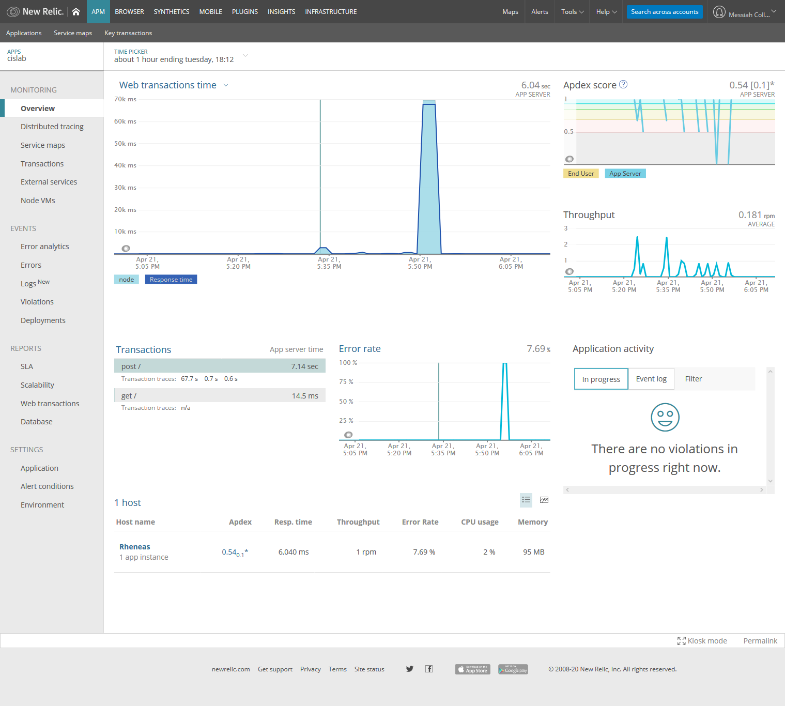
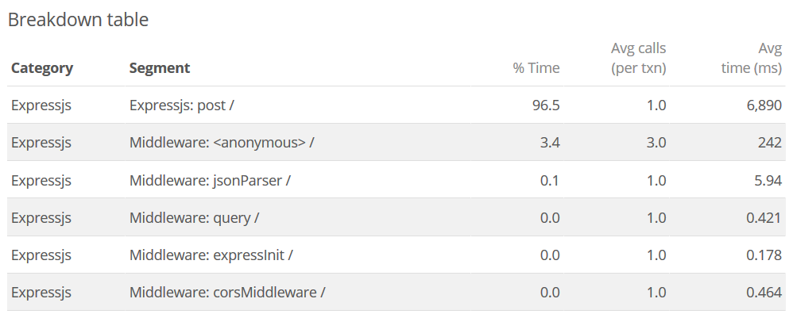
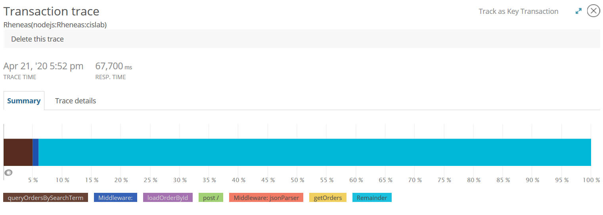
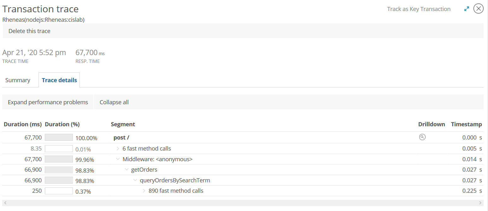
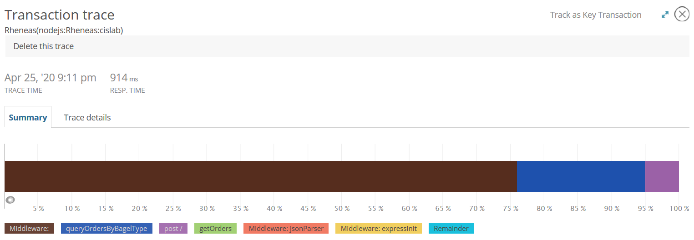
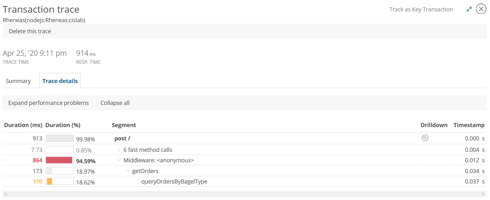

# Lab Report Template for CIS411_Lab3
Course: Messiah College CIS 411, Fall 2018<br/>
Instructors: [Joel Worrall](https://github.com/tangollama) & [Trevor Bunch](https://github.com/trevordbunch)<br/>

Name: Tanner Stern<br/>

GitHub: [tannerstern](https://github.com/tannerstern)<br/>

# Step 1: Fork this repository
- The URL of my forked repository: https://github.com/tannerstern/cis411_lab3

# Step 2: Clone your forked repository from the command line
- My GraphQL response from adding myself as an account on the test project
```
{
  "data": {
    "mutateAccount": {
      "id": "589151d3-5608-4e4b-9299-2185874c245a",
      "name": "Tanner Stern",
      "email": "ts1377@messiah.edu"
    }
  }
}
```

# Step 3: Signup for and configure New Relic
- The chosen name of your New Relic ```app_name``` configuration
```
app_name: ['cislab']
```

# Step 4: Exercising the application / generating performance data

_Note: No lab notes required._

# Step 5: Explore your performance data

* What are your observations regarding the performance of this application?
> The application seemed to do okay with most of the queries, although several of them took entirely too long to respond. One in particular was enormously inefficient, far more than any of the others. One query hit an error and did not execute.
* Is performance even or uneven?
> Performance is uneven.
* Between queries and mutations, what requests are less performant? 
> The queries that performed the worst were those that retrieved data based on a "containing" word. These queries use the "query" keyword and did not search on a specific field in a object, but rather the entire object.
* Among the less performant requests, which ones are the most problematic?
> The most problematic request was the one that did not work, returning an error. The request beginning with `accounts(query: "gmail.com")` failed to run because it searched on `accounts` but expected data members from `items` which could not be resolved.<br>
Of those transactions that did complete, there was one that was monstrously inefficient, taking over a minute to complete.

# Step 6: Diagnosing an issue based on telemetry data
* Within the transactions you're examining, what segment(s) took the most time?
> Far and away, `Expressjs: post /` took the most time at 96.5%.

* Using New Relic, identify and record the least performant request(s).
> One transaction took 67 seconds to complete. This was the request: `orders(query: "everything")`.

* Using the Transaction Trace capability in New Relic, identify which segment(s) in that request permiatation is/are the most problematic and record your findings.
> The New Relic trace capability cannot identify specifically what caused the immense delay on this query (the "remainder" in the screenshot above is a bit cryptic), but it can be used to get an idea of what action contained the delay, which was `queryOrderBySearchTerm`.

* Recommend a solution for improving the performance of those most problematic request(s) / permiatation(s).
> A likely solution to improve performance of the slowest request is to use some other means to query the same data without using expensive "containing the word" queries. An easy way to do this in this case is to search on a specific field for the given search term, rather than in the entire object.

# Step 7: Submitting a Pull Request
_Note: No lab notes required._

# Step 8: [EXTRA CREDIT] Address the performance issue(s)
For the purposes of gaining 25% extra credit on the assignment, perform any of the following:
1. Adjust the diagnosed slow call(s) to improve performance.
> Going along with the recommendation above, I changed the query to search on a specific field. After making the change, the request speed decreased by an amazing 98.5%, down from over 67 seconds to just under 1 second.
2. Verify the improved performance in New Relic, **including data and/or screenshots in your lab report**.
> New Relic captured the improved performance.

Now, the majority of the time spent on the request was the actual `middleware` rather than waiting for the query to return.

2. Check in those changes and **note your solution(s)** in your lab report.
> The fix was very simple: change the line that previously queried the entire object for the word "everything" to only check the `bagel` field. The resulting GraphQL request with this change is below.

```
{
  #retrieve all orders container the word everything
  orders(bagel: "everything") {
    id
    customer {
      id
      email
    }
    items {
      label
      quantity
    }
  }
}
```