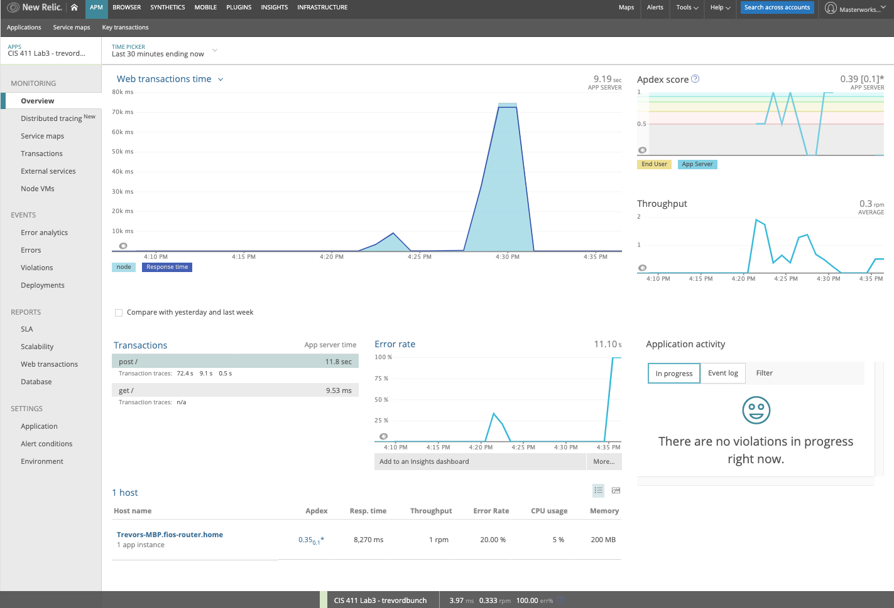

# Lab Report Template for CIS411_Lab3
Course: Messiah College CIS 411, Fall 2018<br/>
Instructors: [Joel Worrall](https://github.com/tangollama) & [Trevor Bunch](https://github.com/trevordbunch)<br/>

Name: TREVOR BUNCH<br/>

GitHub: [@trevordbunch](https://github.com/trevordbunch)<br/>

# Step 1: Fork this repository
- The URL of my forked repository is https://github.com/trevordbunch/cis411_lab3

# Step 2: Clone your forked repository from the command line
- My GraphQL response from adding myself as an account on the test project
``` graphql
{
  "data": {
    "mutateAccount": {
      "id": "3e97afc0-f25c-43ae-9aa0-95a9c0a797f7",
      "name": "Trevor Bunch",
      "email": "tbunch@messiah.edu"
    }
  }
}
```

# Step 3: Signup for and configure New Relic

```
app_name: ['CIS 411 Lab3 - trevordbunch']
```

# Step 4: Exercising the application / generating performance data

_Note: No lab notes required._

# Step 5: Explore your performance data

* What are your observations regarding the performance of this application? 
> Overall, I was pleased with the responsiveness, excpet for a few queries that appeared to take long or the last one that errored out.  A quick indicator was that quick queries were under 500ms and had minimal impact on the Apdex Score.
* Is performance even or uneven? 
> Uneven.
* Between queries and mutations, what requests are less performant? 
> The queries that had an open-ended query parameter (e.g., `query: "PA"`) were less performant than those where the query parameter was limited to a specific field (e.g., `location: "PA"`)
* Among the less performant requests, which ones are the most problematic?
> The last example query errored out because the request for `accounts` wanted `items` returned.  According to the schema, this would need to come through the `order` object.

# Step 6: Diagnosing an issue based on telemetry data
* Within the transactions you're examining, what segment(s) took the most time?
> `Expressjs:post/` consumed 98% of the time.

* Using New Relic, identify and record the least performant request(s).
> There was one post transacton took 72 secs.

* Using the Transaction Trace capability in New Relic, identify which segment(s) in that request permiatation is/are the most problematic and record your findings.
> The less performant requests used the `queryOrdersBySearchTerm` versus `queryOrdersByBagelType`

* Recommend a solution for improving the performance of those most problematic request(s) / permiatation(s).
> In `dbutil.js` (see line 78), searches 6 different fields based on the data input.  This performance could be inproved if the datatype of the parameter could be detected and constrained.  It does not make sense to search a data field with a open string.  Another improvement could be to constrain the search to only `items.type` or `items.label` assuming that location and other queries are better served in earlier queries like `queryOrdersByLocation`.

# Step 7: Submitting a Pull Request
_Note: No lab notes required._

# Step 8: [EXTRA CREDIT] Address the performance issue(s)
For the purposes of gaining 25% extra credit on the assignment, perform any of the following:
1. Adjust the diagnosed slow call(s) to improve performance. 
2. Verify the improved performance in New Relic, **including data and/or screenshots in your lab report**.
3. Check in those changes and **note your solution(s)** in your lab report.