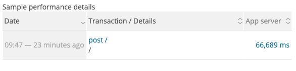
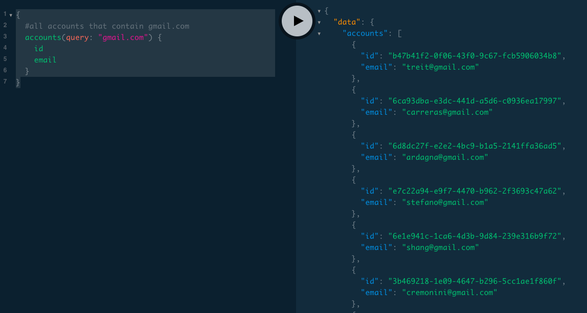

# Lab Report Template for CIS411_Lab3
Course: Messiah College CIS 411, Fall 2018<br/>
Instructors: [Joel Worrall](https://github.com/tangollama) & [Trevor Bunch](https://github.com/trevordbunch)<br/>

Name: Wesley Chong<br/>

GitHub: [wesleycqy](https://github.com/wesleycqy)<br/>

# Step 1: Fork this repository
- https://github.com/wesleycqy/cis411_lab3.git

# Step 2: Clone your forked repository from the command line
- My GraphQL response from adding myself as an account on the test project
```
{
  "data": {
    "mutateAccount": {
      "id": "08295120-a728-404f-9012-b0e71ec67c29",
      "name": "Wesley Chong",
      "email": "wc1182@messiah.edu"
    }
  }
}
```

# Step 3: Signup for and configure New Relic
- The chosen name of your New Relic ```cisLab``` configuration
```
app_name: ['cisLab']
```

# Step 4: Exercising the application / generating performance data

_Note: No lab notes required._

# Step 5: Explore your performance data
* What are your observations regarding the performance of this application? 
This application has varying performance. Certain queries to the database are very quick and are compeleted in the blink of an eye, while others take up to a minute long. 
* Is performance even or uneven? 
The performance is uneven. 
* Between queries and mutations, what requests are less performant? 
The first query and last query are less performant compared to the rest. 
* Among the less performant requests, which ones are the most problematic?
The most problematic one was the last query as it returned an error as the customer id was not specified. 

# Step 6: Diagnosing an issue based on telemetry data
* Within the transactions you're examining, what segment(s) took the most time?
* Using New Relic, identify and record the least performant request(s).
The least performant request was the last one that queried for all instances of "gmail.com"
* Using the Transaction Trace capability in New Relic, identify which segment(s) in that request permiatation is/are the most problematic and record your findings.
The longest lasting segment was the "remainder" segment, taking up 62,900ms (92%) out of the total time of 68,600ms
* Recommend a solution for improving the performance of those most problematic request(s) / permiatation(s).
Instead of querying the entire database and all of the "columns" within it, we can just query the necessary fields. (Eg. just ID field when looking for customer details or just in items when searching for item characteristics. )

# Step 7: Submitting a Pull Request
_Note: No lab notes required._

# Step 8: [EXTRA CREDIT] Address the performance issue(s)
For the purposes of gaining 25% extra credit on the assignment, perform any of the following:
1. Adjust the diagnosed slow call(s) to improve performance.
For the last query: 
{
  #all accounts that contain gmail.com
  accounts(query: "gmail.com") {
    id
    email
  }
}
#This query searches for all instances of "gmail.com" within account emails, and then outputs their IDs and emails. 
2. Verify the improved performance in New Relic, **including data and/or screenshots in your lab report**.
Before: 62,900ms

After:  instant

2. Check in those changes and **note your solution(s)** in your lab report.